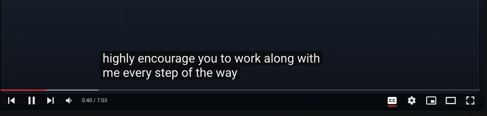

# 🔥 Caption Detective 🔥


**Caption Detective** is a Chrome extension that helps fix misheard proper nouns in YouTube captions using on-device AI (Gemini-nano). For instance, it corrects common mishearings like "view js" to "Vue.js" in real-time, ensuring a smoother viewing experience.

This extension was developed for the **Google Chrome Built-in AI Challenge**, showcasing the capabilities of on-device LLMs through Chrome's Prompt API. You can learn more about the challenge [here](https://googlechromeai.devpost.com/?linkId=11071015).

## 🚀 Features

- **Automatic Detection**: Identifies and corrects misheard technical terms and proper nouns in YouTube captions.
- **On-Device AI**: Utilizes Gemini-nano for fast, private corrections without external API calls.
- **Seamless Integration**: Works directly with YouTube's caption system for a smooth user experience.

## ⚠️ Disclaimer

- Due to the limited capabilities of Gemini-nano, this extension may exhibit flaky behavior and may not always work as intended.
- The initial intent was to allow the LLM to read entire sentences and replace words as needed. While this approach may work with more advanced models like GPT-4o, current lightweight models such as Gemini-nano often struggle to understand the instructions correctly. As a result, the implementation has been broken down into multiple smaller tasks, such as identifying related topics and words. The actual replacement of words is performed without the assistance of Gemini-nano, which contributes to the inconsistency in performance.
- Currently, the extension only reads the video title and description. However, when more advanced LLMs become available in Chrome in the future, this extension could potentially learn the context of the video **as it plays**, leading to improved results over time.

## 📋 Prerequisites

To use this extension, you need to sign up for the **Google Chrome Built-in AI - Early Preview Program**. You can register [here](https://docs.google.com/forms/d/e/1FAIpQLSfZXeiwj9KO9jMctffHPym88ln12xNWCrVkMY_u06WfSTulQg/viewform?resourcekey=0-dE0Rqy_GYXDEWSnU7Z0iHg) to gain access to the necessary features and updates.

## ⚙️ Configuration

The extension provides a user-friendly settings interface where you can adjust various configuration options for the proper noun extraction process. The available settings include:

- **Verify Proper Nouns**: Enable this option to verify the extracted proper nouns for accuracy.
- **Check Suspicious Nouns**: Turn this on to check for nouns that may not have been transcribed correctly.
- **Brainstorm Related Words**: When enabled, this option generates related proper nouns based on the context of the input.

You can access and modify these settings through both the extension's options page and the popup.

## 📦 Installation

### Local Development

1. **Clone the Repository**:
   ```bash
   git clone https://github.com/yourusername/caption-detective.git
   cd caption-detective
   ```

2. **Install Dependencies**:
   ```bash
   pnpm install
   # or
   npm install
   ```

3. **Build the Extension**:
   ```bash
   pnpm build
   # or
   npm run build
   ```

4. **Load the Extension in Chrome**:
   - Open Chrome and navigate to `chrome://extensions/`
   - Enable **Developer mode** in the top right corner
   - Click **Load unpacked**
   - Select the `build/chrome-mv3-dev` directory from this project

### Pre-built Version

1. **Download the Latest Release** from the [GitHub Releases page](https://github.com/yuichkun/caption-detective/releases).
2. **Unzip the Downloaded File**.
3. **Follow Step 4** from the Local Development section above to load the extension.

## 🛠️ Development

To start the development server, run:
```bash
pnpm dev
# or
npm run dev
```
The extension will auto-update as you make changes. Remember to reload the extension in `chrome://extensions/` to see the latest updates.

## 📈 Making a Production Build

Run the following command to create a production bundle for your extension:
```bash
pnpm build
# or
npm run build
```
This bundle is ready to be zipped and published to the stores.

## 🤝 Contributing

Contributions are welcome! Feel free to submit a Pull Request.

## 📜 License

This project is licensed under the MIT License. See the [LICENSE](LICENSE) file for details.

## 🙏 Acknowledgments

- Built with [Plasmo](https://docs.plasmo.com/)
- Developed for the Google Chrome Built-in AI Challenge
